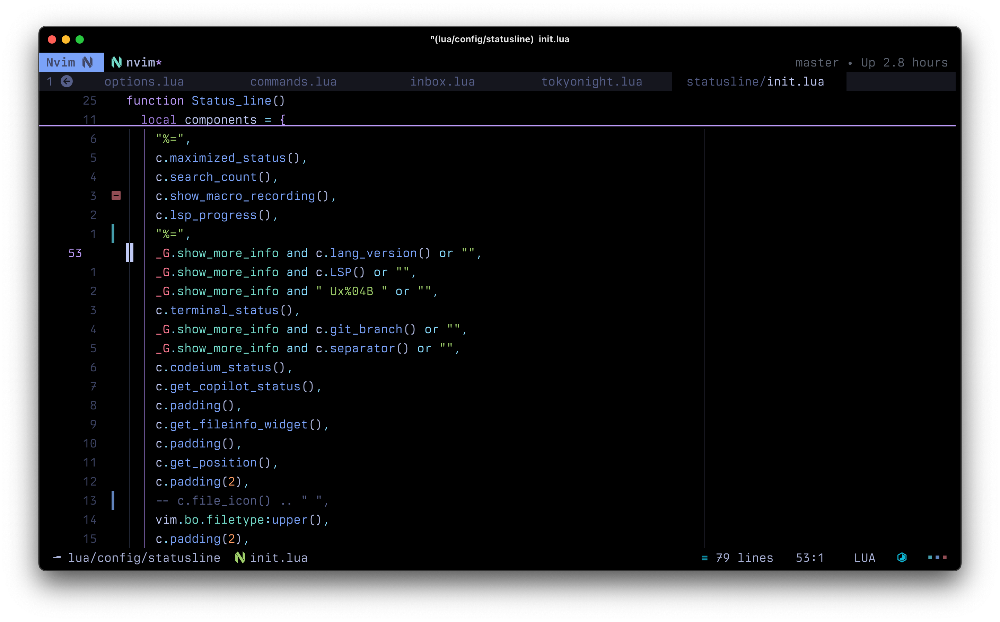

# Neovim Configuration

This is my Neovim configuation written in Lua (wip).

## Basic setup

- **Preferred themes (wip)**: I like monotone themes so I decided to make my own based on VSCode and Zed' Github Light Monochrome themes. 🎨 Here it is: [idr4n/github-monochrome.nvim](https://github.com/idr4n/github-monochrome.nvim). For more colorful ones, I use [dracula.nvim](https://github.com/Mofiqul/dracula.nvim) and [folke/tokyonight.nvim](https://github.com/folke/tokyonight.nvim)
- **Terminals**: Ghostty, Alacritty, WezTerm or Kitty. To check my terminals configuration, take a look at my [dotfiles](https://github.com/idr4n/.dotfiles) and my [WezTerm configuration](https://github.com/idr4n/wezterm).
- **Font**: I switch back and forth between [Berkeley Mono](https://usgraphics.com/products/berkeley-mono), [FiraCode](https://github.com/tonsky/FiraCode), [MonoLisa](https://www.monolisa.dev/), and Zed Plex Mono, the default font of the [Zed Editor](https://github.com/zed-industries/zed).
- I'm using [lazy.nvim](https://github.com/folke/lazy.nvim) as my package manager with a Neovim startup time of around 45ms⚡️.

## Installation

You should be able to clone this repo in `~/.config/nvim`, and start Neovim, for almost everything to work out of the box. However, the following is recommended to keep in mind:

- This config has been tested in Neovim nightly, but the latest stable version should work just fine, in both macOS and Linux (not Windows, unfortunately).
- Make sure that you have `npm` and `tree-sitter-cli` installed.
- (Optional but recommended) Add this script to your path ([get_lang_version](https://github.com/idr4n/.dotfiles/blob/master/scripts/get_lang_version)) so you can get the language version for Lua, Python, Golang, etc., in the statusline (when toggling extra info in the statusline with `<space>ti`).
- I would recommend commenting out at least `latex` and `swift` in the list of `ensured_installed` in `lua/plugins/nvim-treesitter.lua`, as they require some manual configuration in your system, as far as I know.
- Take a look at the list of `ensure_installed` servers in `lua/config/lsp/server_names.lua` and comment out or delete the ones you don't need. These servers are installed by `Mason` automatically.
- There are some commands in `lua/config/commands.lua` that would work only in macOS (e.g., those with `open -a`). This would not give you an error in Linux unless you try to trigger those commands. So either adjust them or delete them.
- Similarly, a command like `MdToPdfWatch` requires a `pandoc` setting in your system that you can get from my [dotfiles](https://github.com/idr4n/.dotfiles). Same for `:CodeRun<cr>`, you need to install this [script](https://github.com/idr4n/.dotfiles/blob/master/scripts/code_run) in your path.

## Useful mappings

A list of frequently-used mappings:

 

- Leader key: `<space>`
- Open the file picker: `<C-space>` (Snacks picker)
- Open another file picker (Fzf-Lua): `<space>ff`
- Close (delete) current buffer: `<space>x`
- Grep across project (Fzf-Lua): `<space>r` in normal or visual mode
- Quit: `<space>qq`
- Force quit: `<space>qQ`
- Save buffer: `<C-S>` in both normal and insert modes
- Save without formatting: `<space>w`
- File tree view:
    - Nvimtree: `<space><space` to show and `,e` to focus.
    - Neo-tree: `<C-.>` to show and `<space>e` to focus.
- File managers:
    - mini.files: `<C-q>`
    - Oil: just `-`
    - Yazi: `<space>-`
- Go back to the last visited buffer: `ga` in normal mode
- Go to next buffer: `L`
- Go to previous buffer: `H`
- Open the list of opened buffers (Telescope): `s` in normal mode, `s` to close the list, `j`, `k` to select, and `l` to open selection.
- Toggle horizontal terminal: `<A-\>`
- Toggle vertical terminal: `<C-\>`
- Go from terminal to normal buffer: `<C-T>`. Press again to go from buffer to terminal
- Go to the next window (skipping Neo-tree and Nvimtree): `<C-T>`
- Use `<C-L>` in normal mode (and in insert mode if no completion is being shown) to move the view around the cursor to both center and top. That is, both `zz` and `zt` with just one keybinding
- Toggle maximize window (including a Terminal buffer): `<A-,>`
- Toggle extra information in the statusline: `<space>ti`
- Toggle line wrap: `<space>tw`
- Toggle spell check: `<space>tS`
- Different fold levels: `z1`, `z2`, `z0`. Check more in `lua/config/mappings.lua`
- Git:
    - Check status: `<space>gs`
    - Open Neogit: `<space>gn`
    - Open Lazygit: `<space>gl`
    - Open Vim-Fugitive: `<space>gi`
    - Stage hunk or selection in current buffer: `<space>hs`, or `<space>hS` to stage all changes in the current buffer. Check other mappings under `<space>h`.
- Completions and snippets (LuaSnip):
    - Select next completion suggestion: `<Tab>`
    - Select previous completion suggestion: `<S-Tab>`
    - Confirm completion or snippet suggestion: `<C-L>`
    - Jump to next snippet placeholder: `<C-J>` in insert and selection mode
    - Jump to previous snippet placeholder: `<C-K>` in insert and selection mode

**Note**: although the system clipboard is enabled, motion mappings such as `d`, `c`, `x`, etc., do not copy to the clipboard (ala easy-clip plugin). That is, if you select something and use `d`, that text is deleted and sent to the 'black hole register'. If you want to delete some text to paste it somewhere else, use `m` instead (use `gm` for adding a mark). Take a look at the "Replace the easy-clip plugin" section in `lua/config/mappings.lua`.

## Other nice commands

- `:TrimTrailingWhitespace<cr>` in both current line (normal mode) or selection (visual mode)
- `:ShuffleLines<cr>` with selection
- `:ShuffleParagraphs<cr>` with selection (the last paragraph should be followed by an empty line)
- `:CopyNoBullets<cr>` with selection, to copy a markdown list but each line without '-'

