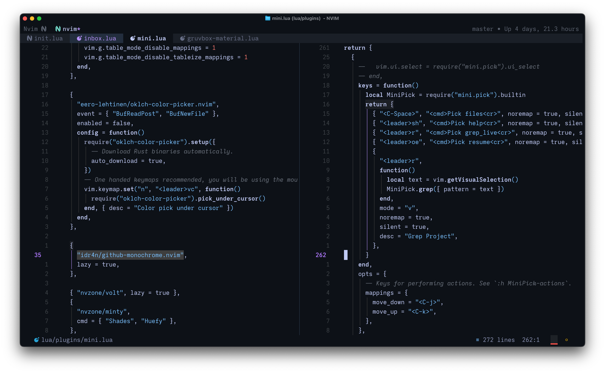
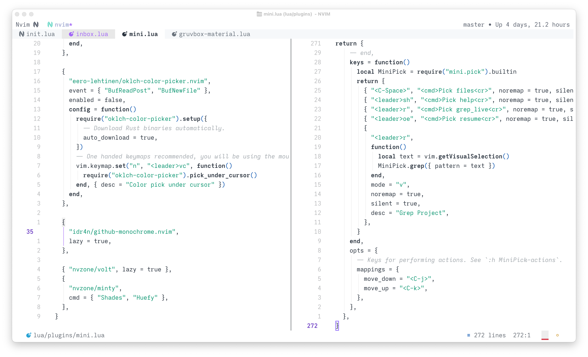

# Neovim Configuration

This is my Neovim configuation written in Lua (wip).

## Basic setup

- **Preferred themes (wip)**: I like monotone themes so I decided to make my own, which will be published soon, based on Github Light Monchrome which is available for both Zed and VSCode, but not for Neovim (as far as I know). For more colorful ones, I use [dracula.nvim](https://github.com/Mofiqul/dracula.nvim) and [folke/tokyonight.nvim](https://github.com/folke/tokyonight.nvim)
- **Terminals**: Ghostty, Alacritty, WezTerm or Kitty. To check my terminals configuration, take a look at my [dotfiles](https://github.com/idr4n/.dotfiles) and my [WezTerm configuration](https://github.com/idr4n/wezterm).
- **Font**: I have been switching back and forth between [FiraCode](https://github.com/tonsky/FiraCode) and [MonoLisa](https://www.monolisa.dev/); however, I have recently settled on a customized version of Iosevka based on Zed Mono.
- I'm using [lazy.nvim](https://github.com/folke/lazy.nvim) as my package manager with a Neovim startup time of around 42ms⚡️.

