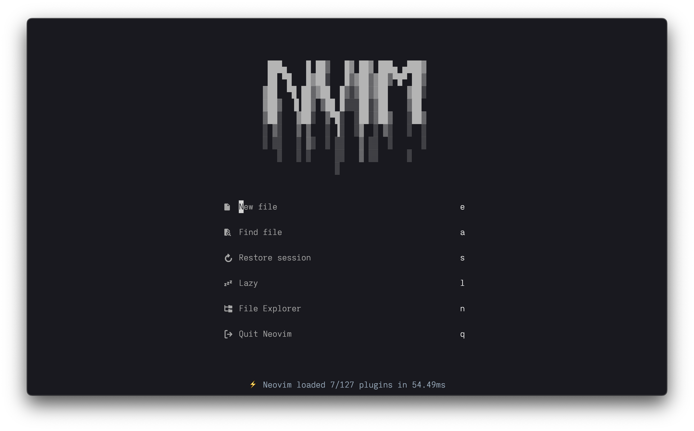
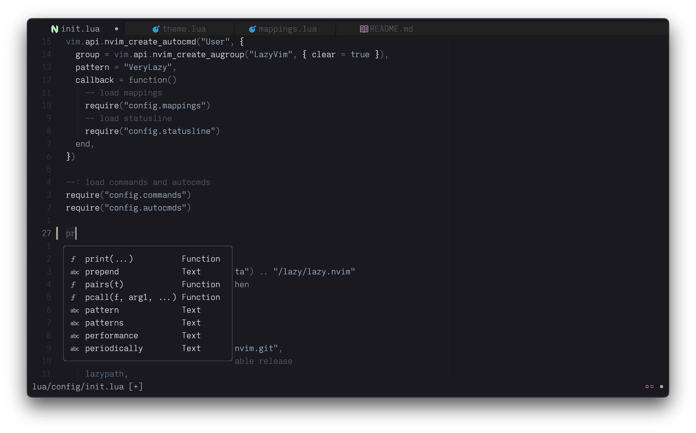

# Neovim Configuration

This is my Neovim configuation written in Lua (wip).

## Basic setup

- **Preferred themes (wip)**: I often prefer monotone themes such as [nvim-noirbuddy - slate](https://github.com/jesseleite/nvim-noirbuddy) or Zenbones. However, sometimes I use more colorful ones like [dracula.nvim](https://github.com/Mofiqul/dracula.nvim) and [nord.nvim](https://github.com/gbprod/nord.nvim).
- **Terminals**: Alacritty, WezTerm or Kitty. To check my terminals configuration, take a look at my [dotfiles](https://github.com/idr4n/.dotfiles) and my [WezTerm configuration](https://github.com/idr4n/wezterm).
- **Font**: I have been switching back and forth between [FiraCode](https://github.com/tonsky/FiraCode) and [MonoLisa](https://www.monolisa.dev/); however, I have recently settled on a customized version of Iosevka based on Zed Mono.
- I'm using [lazy.nvim](https://github.com/folke/lazy.nvim) as my package manager, which allows me to start Neovim in around 50ms⚡️.

## Credits

These are some of the repos I have borrowed ideas from for my Neovim config (although, there are many others that I can't keep tracked of, unfortunately):

- [LazyVim](https://github.com/LazyVim/LazyVim)
- [ChristianChiarulli/lvim](https://github.com/ChristianChiarulli/lvim)
- [ThePrimeagen/.dotfiles](https://github.com/ThePrimeagen/.dotfiles)
- [tjdevries/config_manager](https://github.com/tjdevries/config_manager)
- [joshmedeski/dotfiles](https://github.com/joshmedeski/dotfiles)
- [jonhoo/configs](https://github.com/jonhoo/configs)
- [Ben Frain's config](https://gist.github.com/benfrain/97f2b91087121b2d4ba0dcc4202d252f)
- [nyoom-engineering/nyoom.nvim](https://github.com/nyoom-engineering/nyoom.nvim)
- [MariaSolOs/dotfiles](https://github.com/MariaSolOs/dotfiles)
